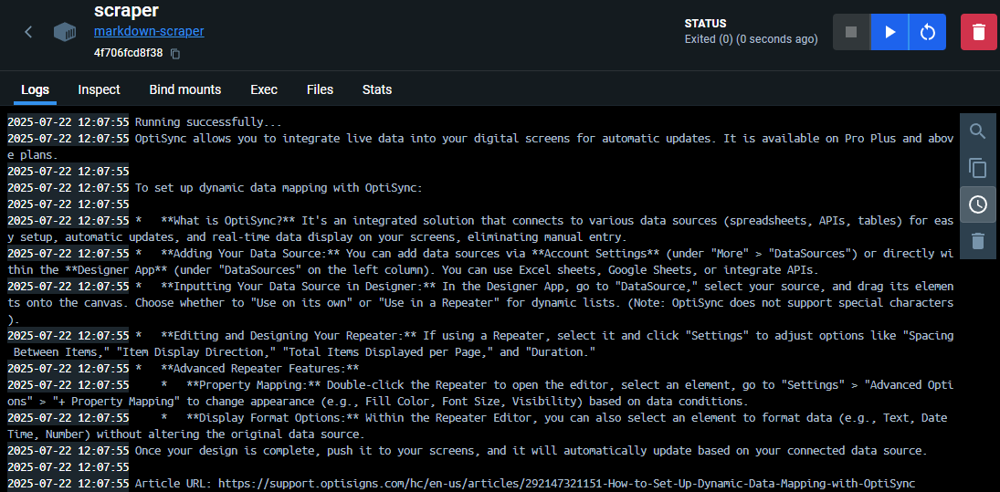
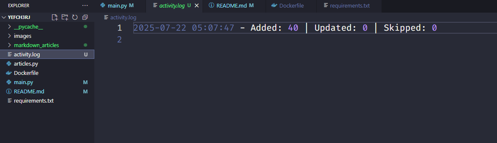

## <a name="solution">Solution</a>
**Problem 1**

I successfully met all the requirements for this task. The full implementation is in `articles.py`.

##### What I Did

- Used the [Zendesk API](https://support.optisigns.com/api/v2/help_center/en-us/articles.json?per_page=40) to fetch articles from `support.optisigns.com`.
- Parsed and normalized the content of each article to **clean Markdown**:
  - Preserved **headings**, **code blocks**, and **relative links**
  - Removed unwanted UI elements like **navigation**, **ads**, or formatting noise
- Saved each article as a Markdown file named using its **slug** inside the `markdown_articles/` folder.
- Pulled and converted **30+ articles** as required.

> Example output path: `markdown_articles/accepted-payment-methods.md`

**Problem 2**
##### Limitation: No Access to OpenAI Playground
Due to the lack of an **international payment method** (Visa/MasterCard), I was **unable to access the OpenAI Playground**, which is required to test and interact with assistants via their UI.
##### Alternative Solution Using Gemini API
To work around this, I implemented the assistant logic using the **Gemini API**. However, the Gemini API has several limitations compared to OpenAI’s platform:
- Gemini Playground does not integrate with API uploads — files or context passed via API are **not visible or accessible** in the UI.
- There is no equivalent of OpenAI's Assistants API in Gemini that allows structured system prompts, persistent memory, or document-aware responses in the Playground.
- All interaction with Gemini (system prompt, file upload, message exchange) is handled entirely through the API.


Because Gemini's Playground cannot access API-uploaded content, I was unable to demonstrate the assistant in the UI as required. However, the assistant behavior aligns with the system prompt and responds properly through API.

Here’s an example response to the question:  
**“How to set up dynamic data mapping with OptiSync?”**


**Problem 3**
#### Deployment & Update Strategy
##### Limitation: No Access to International Payment Methods
I currently **do not have access to an international payment method** (such as Visa or MasterCard), which is required by services like **DigitalOcean**, **Render**, and **Railway** to deploy scheduled container jobs.  
As a result, I was unable to deploy the scraper as a daily job on these platforms.
##### Local-Ready Alternative
Despite this limitation, the project is fully **Dockerized** and ready for deployment on any container-friendly platform that supports scheduled execution.  
You can find the `Dockerfile` in the root of the repository.
#### Delta-Based Update Strategy
To meet the requirement of uploading **only new or modified articles**, the scraper uses a **content hash-based approach**:

- On each run, it:
  - **Computes the current hash** of every Markdown file based on its content.
  - **Compares** each hash with the previously stored hash in `meta.json` (located in the `markdown_articles/` folder).
  - Based on this comparison, it decides whether to:
    - **Add** the file (if it's new),
    - **Update** the file (if the hash has changed),
    - **Skip** the file (if the hash is unchanged).
#### Logging Activity
Each time the scraper runs, it logs activity into an `activity.log` file. It includes:

- Counts of articles:
  - Added
  - Updated
  - Skipped
- Timestamps and status messages for traceability

Here’s an example of the log format:

## <a name="quick-start">Quick Start</a>
**Prerequisites**

Make sure you have the following installed on your machine:
- [Git](https://git-scm.com/)
- [Docker](https://www.docker.com/get-started)  

**Cloning the Repository**
```bash
git clone https://github.com/VungDo404/YEFch3Rj
cd YEFch3Rj
```
**Build Docker image**
```bash
docker build -t markdown-scraper .
```
**Run Docker image**
> **In PowerShell**
```powershell
docker run -d --name scraper -e API_KEY=YOUR_KEY_GOES_HERE -v ${PWD}:/app markdown-scraper
```
> **In Git Bash / Linux / macOS / WSL Terminal**
```bash
docker run -d --name scraper -e API_KEY=YOUR_KEY_GOES_HERE -v ${PWD}:/app markdown-scraper
```

**Note:** `API_KEY` should be your **Gemini API key**.  
You can obtain one from: [https://aistudio.google.com/app/apikey](https://aistudio.google.com/app/apikey)